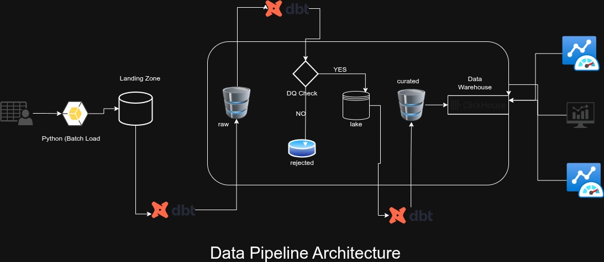
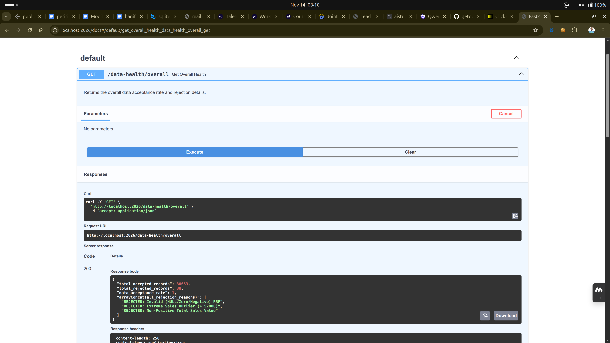
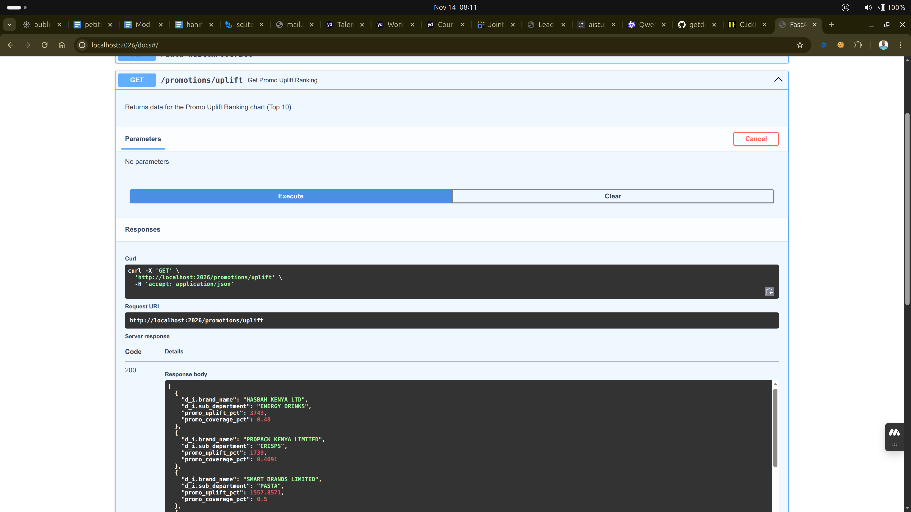
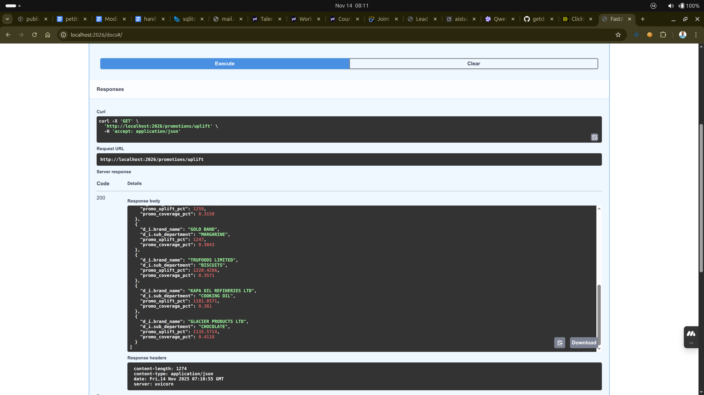
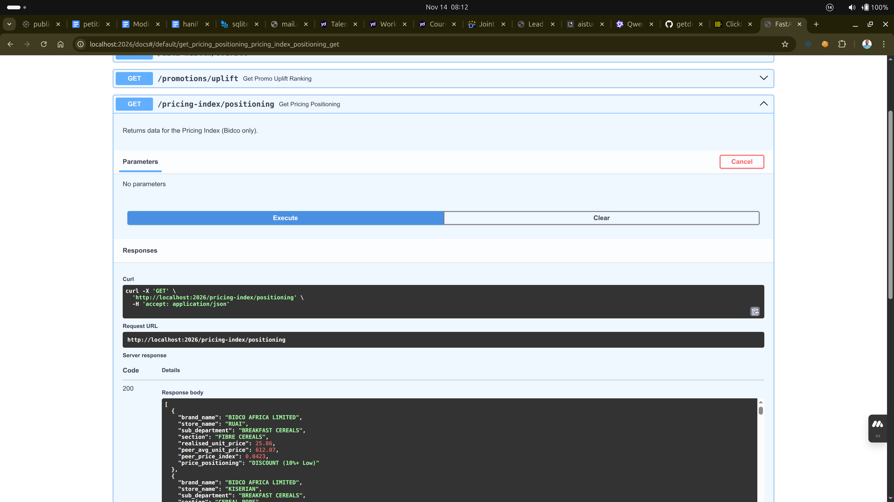
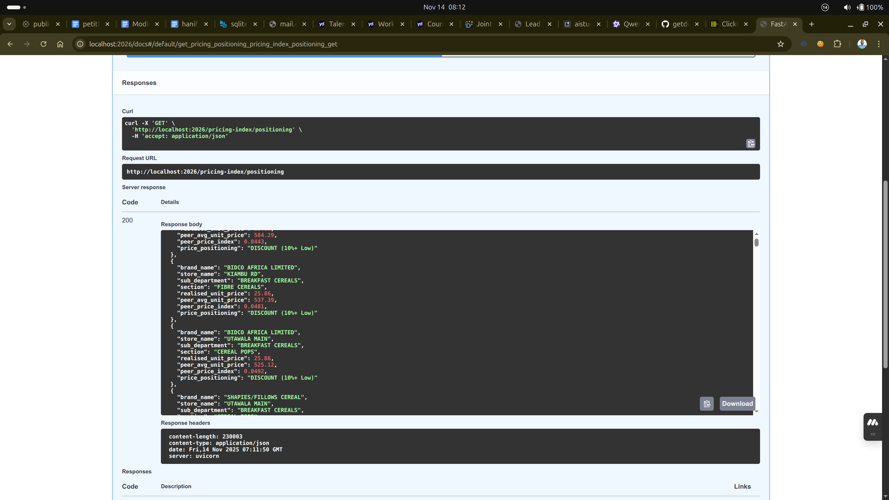
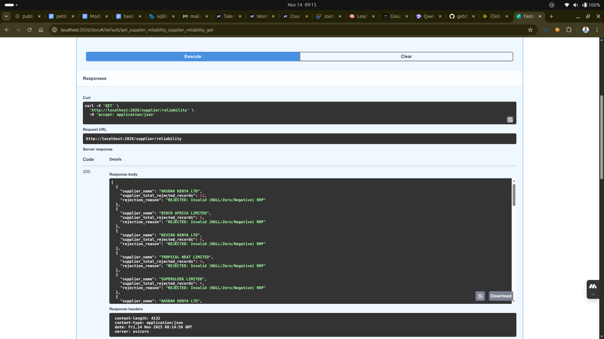
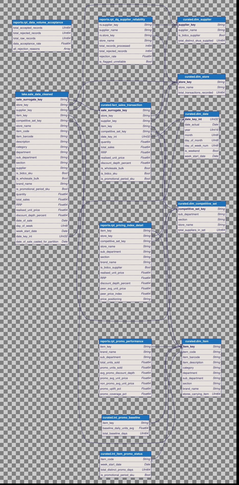

# 🦆 Duck Retail Data Challenge: Bidco Africa Commercial Data Pipeline

## 🚀 Overview
This repository contains a modern, production-grade data pipeline designed to transform raw, fragmented retail sales data into actionable commercial insights for Bidco Africa Limited.

The solution uses a ClickHouse-backed Data Lakehouse orchestrated by dbt (Data Build Tool), with final results delivered via a simple FastAPI service for consumption by BI tools, dashboards, and other applications.


### 📚 Documentation
- **[DBT_SQL_DOCUMENTATION.md](./DBT_SQL_DOCUMENTATION.md)** - Comprehensive guide to all SQL transformations (12 sections, 2,000+ lines)
  - Architecture overview and medallion pattern explanation
  - Detailed analysis of all 14 models (raw → curated → reports)
  - Critical business decisions and data quality measures
  - Typical analysis workflows and best practices
  
- **[MODEL_EXECUTION_REPORT.md](./MODEL_EXECUTION_REPORT.md)** - Latest model run results (23 November 2025)
  - All 14 models executed successfully in 1.79 seconds
  - Data quality metrics (99.88% acceptance rate)
  - Sample outputs from each layer
  - Performance analysis and recommendations

- **[EXECUTIVE_PRESENTATION.md](./EXECUTIVE_PRESENTATION.md)** - Executive stakeholder presentation
  - Key discoveries and commercial insights
  - Top promotional performers with verified metrics
  - Competitive pricing intelligence
  - Actionable recommendations for Bidco

## 💻 How to Run

### Prerequisites
- Docker and Docker Compose

### Instructions
1.  **Initial Build & Start Services:**
    ```bash
    docker-compose up --build -d
    ```
2.  **Run dbt Transformations:**
    ```bash
    docker-compose exec dbt_cli dbt run --target prod
    ```
3.  **Run dbt Tests** (recommended):
    ```bash
    docker-compose exec dbt_cli dbt test
    ```
4.  **Access the API:**
    The API documentation is available at [http://localhost:2026/docs](http://localhost:2026/docs).

### Services
- `clickhouse`: ClickHouse database, accessible on the host at port `2025`.
- `python_api`: The FastAPI application, accessible on the host at port `2026`.
- `dbt_cli`: A container for running dbt commands against the data warehouse.

## 🛠️ Data Pipeline Architecture
The pipeline follows an ELT (Extract, Load, Transform) approach:

1.  **Extract & Load**: Raw CSV data is loaded into a ClickHouse database, which acts as the storage layer for our Data Lakehouse.
2.  **Transform**: `dbt` runs a series of version-controlled SQL models to clean, transform, and aggregate the raw data. This process creates structured data marts, including:
    - **Lake**: Cleaned, standardized base tables.
    - **Curated**: Dimension and fact tables based on a Star Schema model.
    - **Reports**: Final aggregated tables that power the API endpoints.
3.  **Serve**: A FastAPI application queries the final report tables in ClickHouse and exposes the data through a REST API.

### Technology Stack
| Layer | Technology | Rationale (Cost-Optimization & Resilience) |
| :--- | :--- | :--- |
| **Storage (Raw/Lake)** | ClickHouse (Table Data) | Leverages inexpensive object storage for the data lake, only moving optimized data into high-performance ClickHouse tables for query processing. |
| **Transformation** | dbt (Data Build Tool) | Provides version control, lineage, testing, and ensures repeatable, reliable transformations (ELT/SQL-first approach). |
| **Data Warehouse (OLAP)**| ClickHouse | Optimized for high-speed analytical queries (aggregations, window functions) required for the Pricing Index. Highly efficient on columnar data. |
| **API / Presentation** | FastAPI | FastAPI provides a lean, performant API endpoint for reliable data delivery. |
| **Modeling** | Star Schema | Separates facts (sales events) from dimensions (products, stores, suppliers), maximizing query performance and flexibility for BI users. |

### Data Pipeline Architecture Diagram



## ✅ Data Quality & Governance
The pipeline implements a "Flag and Filter" strategy, ensuring immutability in the Raw Layer while guaranteeing a clean Silver/Gold Layer for reporting.

| Check Implemented | Rationale & Outcome |
| :--- | :--- |
| **Deduplication** | Unique sales events are enforced by generating a composite key on (Store, Item, Date, Quantity, Price, etc.) and filtering for `ROW_NUMBER() = 1`. |
| **Negative/Null Filter** | Transactions with non-positive `Quantity`, `Total Sales`, or `RRP` are removed from the clean pipeline. |
| **Extreme Outlier Removal** | Transactions where `Total Sales` exceeded $52,000 (a commercially indefensible level for a single line-item in this FMCG dataset) were removed to prevent skewing aggregates. |
| **`rpt_data_volume_acceptance`** | **Overall Acceptance Rate: 99.88%**. The pipeline confirms the underlying raw data quality is high. |
| **`rpt_dq_supplier_reliability`** | Identified specific, low-volume suppliers whose data contributes most to rejection (e.g., BEECARE APIARIES with 100% rejection rate on 1 record). |
| **Dimension Table Uniqueness** | dbt tests ensure one row per dimension key, preventing cartesian product inflation (21 tests, 100% pass rate). |


## 💡 Commercial Insights & Actions for Bidco

#### A. Promotions & Uplift (Informs: Marketing Budget Allocation)

**Top Promotional Performers** (by Uplift %):

| Rank | Brand | Category | Uplift % | Coverage % | Implication | Actionable Recommendation |
| :--- | :--- | :--- | :--- | :--- | :--- | :--- |
| 🥇 1 | **PREMIER FOODS** | Sauces | **+1,307%** | **67%** | Exceptional promotional responsiveness - 14x baseline sales during promo period. | **Replicate Strategy**: Study this promotional approach for application to other categories. Highest coverage in top 5. |
| 🥈 2 | **CANON CHEMICALS** | Dishwashing | **+586%** | **60%** | High-value items (343.97 KES avg) show strong promotional elasticity. | **Premium Focus**: Prioritize promotions for premium-priced categories with high margins. |
| 🥉 3 | **ZENKO KENYA** | Wipes | **+500%** | **32%** | Strong uplift but low coverage - significant expansion opportunity. | **Expand Coverage**: Test promotional rollout to remaining 68% of stores. |
| 4 | **CADBURY** | Chocolate | **+457%** | **50%** | Chocolate category responds well to promotions with balanced coverage. | **Maintain Momentum**: Continue promotional investment in chocolate category. |
| 5 | **HASBAH KENYA** | Energy Drinks | **+350%** | **48%** | Energy drinks show 4.5x baseline with moderate coverage. | **Expand Rollout**: Increase promotional budget; test wider store penetration. |

**Key Insights**:
- **Sauces and dishwashing** show highest promotional responsiveness (1,307% and 586% uplift)
- **Coverage gaps exist**: Top performers only reach 32-67% of stores
- **Opportunity**: Standardize promotional calendar across all store formats to maximize reach

#### B. Competitive Pricing Index (Informs: Margin Protection)
The Pricing Index measures `(Own Brand Price / Peer Average Price)`.

**Bidco Brands - Price Positioning**:

| Bidco Brand | Product Format | Price Index (PPI) | Finding | Actionable Recommendation |
| :--- | :--- | :--- | :--- | :--- |
| **GOLD BAND** | Fats Spread | 0.682 (32% Below Peer) | **Aggressive Discount**: Significantly underselling competitors. May be leaving margin on table. | **Test Price Increase**: Pilot a 10-15% price increase (moving PPI to 0.75-0.79). Monitor volume impact. |
| **GOLD BAND** | Margarines | 0.808 (19% Below Peer) | **Value Positioning**: Moderate discount vs competitors. | **Maintain or Test**: Consider small price increase to 0.85 if volume is stable. |
| **RIBENA** | Cordials/Tetra | 1.57 (57% Above Peer) | **Premium Positioning**: Successfully commands premium pricing in select stores. | **Segment Strategy**: Maintain premium in high-income areas; consider graduated pricing by store format. |

**Pricing Insights**:
- **Dual strategy**: Bidco operates both DISCOUNT (Gold Band) and PREMIUM (Ribena) positioning
- **Store variation**: RIBENA pricing varies significantly by location (0.52x to 2.41x peer average)
- **Margin opportunity**: GOLD BAND Fats Spread at 0.682x may be too aggressive (32% discount)

#### C. Data Quality Insights (Informs: Operational Excellence)

| Metric | Value | Insight |
| :--- | :--- | :--- |
| **Data Acceptance Rate** | **99.88%** | Excellent overall data quality |
| **Total Rejected Records** | 38 out of 30,691 | Only 0.12% rejection rate |
| **Primary Issue** | Invalid RRP (84% of rejections) | Target RRP validation at source system |
| **Supplier Reliability** | 0 flagged as unreliable | No systematic quality problems |

**Recommendation**: Implement RRP validation rules at data entry to reduce the 32 records rejected for invalid RRP values.


## 📦 API Endpoints & Presentation

A simple, fast API exposes the clean data marts for production use.

| Endpoint | Data Mart | Description |
| :--- | :--- | :--- |
| `/data-health/overall` | `rpt_data_volume_acceptance` | Returns the overall data acceptance rate and rejection details. |
| `/promotions/uplift` | `rpt_promo_performance` | Returns data for the Promo Uplift Ranking chart (Top 10). |
| `/pricing-index/positioning`| `rpt_pricing_index_detail` | Returns data for the Pricing Index (Bidco only). |
| `/supplier/reliability` |  `rpt_dq_supplier_reliability` and `rejected_data_process` | Provide a detailed breakdown of data quality issues per supplier. |

This stack provides the agility required to meet commercial demands while maintaining the integrity required for enterprise-level data operations.

### Endpoint API Screenshot







## 🧪 Testing & Quality Assurance

### dbt Tests Implemented (v2.0.0)

**21 comprehensive tests** ensure data quality and prevent future issues:

- **Dimension Tables**: Uniqueness and not-null constraints on all primary keys
- **Fact Table**: Data quality checks (quantity > 0, reasonable row counts)
- **Intermediate Tables**: Baseline calculation integrity

**Test Results**: ✅ **21/21 PASS** (100% pass rate)

Run tests:
```bash
docker-compose exec dbt_cli dbt test
```

## 📊 Entity-Relationship (ER) Diagram



**Project Status**: ✅ Production Ready  
**Last Updated**: November 23, 2025  
**Data Quality**: 99.88% acceptance rate  
**Test Coverage**: 21/21 tests passing
